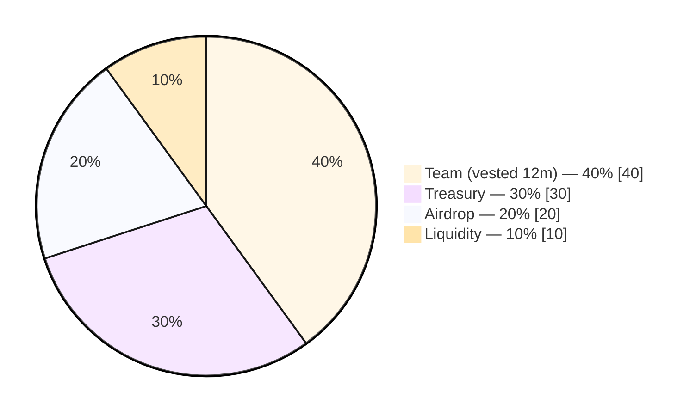
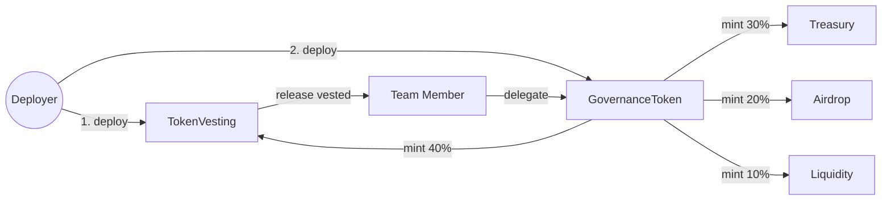

# DAO & On-chain Governance System

Production-grade DAO infrastructure built with **Foundry** and **OpenZeppelin v5.1.0**.

## Part 1 — Governance Token & Vesting

This module ships two contracts:

| Contract | Purpose |
| --- | --- |
| [`GovernanceToken.sol`](src/GovernanceToken.sol) | ERC-20 with `ERC20Votes` (Compound-style delegation) and `ERC20Permit` (EIP-2612 gasless approvals). Total supply minted once and split across four buckets. |
| [`TokenVesting.sol`](src/TokenVesting.sol) | Linear, 12-month vesting vault that holds the team's 40% allocation. Protected by `ReentrancyGuard` and follows the Checks-Effects-Interactions pattern. |

### Tokenomics

- **Total supply:** `100,000,000 GOV` (18 decimals), minted exclusively in the constructor.
- **Allocations** (basis-point exact, no rounding remainder):



### Architecture



> **Deployment order note.** `TokenVesting` is deployed *first* using a CREATE-address prediction for the `GovernanceToken`. The token's constructor then mints 40% directly into the already-deployed vault, removing the need for a post-deploy `transfer` step. See [`test/GovernanceToken.t.sol`](test/GovernanceToken.t.sol) (`DeployFixture`) for the canonical pattern.

### Security highlights

- **Custom errors** (`ZeroAddress`, `DuplicateRecipient`, `NoSchedule`, `NothingToRelease`, …) instead of `require`-strings — gas savings and structured revert reasons.
- All state mutations precede external calls; `release()` is guarded with `nonReentrant`.
- `ERC20Votes` checkpoints use `block.timestamp` (`CLOCK_MODE() == "mode=timestamp"`), aligning with EIP-6372 and modern `Governor` deployments.
- `TokenVesting` enforces the invariant `balance ≥ outstanding + newAmount` before creating each schedule — preventing over-allocation.

### Test coverage

22 tests across 3 suites, all passing.

```
forge test
```

| Suite | Highlights |
| --- | --- |
| `GovernanceTokenAllocationTest` | Total supply, exact 40/30/20/10 split, zero-address and duplicate-recipient reverts. |
| `GovernanceTokenVotesTest` | Self-delegation activation, third-party delegation, `getPastVotes` snapshots before/after transfer, EIP-2612 `permit` signature flow with relayer, expired-deadline revert, EIP-6372 clock mode. |
| `TokenVestingTest` | Zero release at `t = start`, exact 50% release at half-way, full release after duration, clamping past the schedule end, accumulating partial releases at 25% / 75% milestones, future-start schedules, `NoSchedule` / duplicate / non-owner / over-allocation reverts, end-to-end vest-then-delegate flow. |

### Running the project

```bash
forge install              # restore submodules
forge build                # compile
forge test -vv             # run the suite
```

### Layout

```
src/
├── GovernanceToken.sol    # ERC20 + Votes + Permit
└── TokenVesting.sol       # 12-month linear vesting
test/
└── GovernanceToken.t.sol  # 22 tests, 3 suites
```
