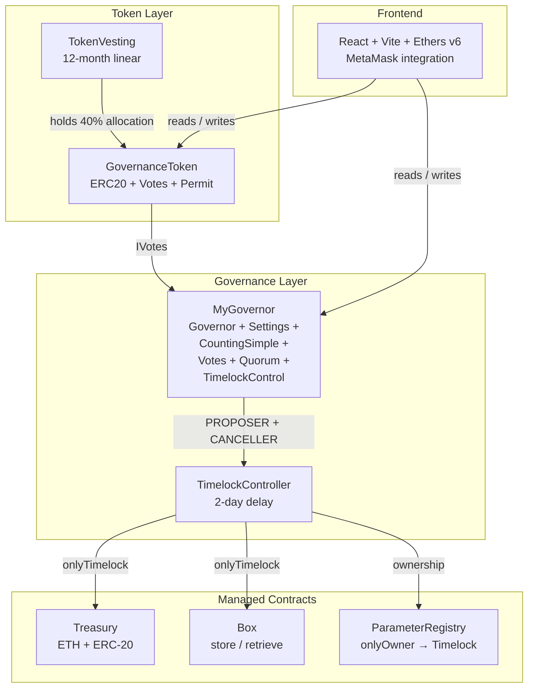

# DAO & On-chain Governance System

Production-grade DAO infrastructure built with **Foundry** and **OpenZeppelin v5.1.0**, featuring a governance token, linear vesting, on-chain governor, treasury, and a React/Vite frontend.

---

## Architecture overview



---

## Tokenomics

**Total supply:** `100,000,000 GOV` (18 decimals), minted once in the constructor.


---

## Contract summary

| Contract | Source | Purpose |
| --- | --- | --- |
| `GovernanceToken` | [`src/GovernanceToken.sol`](src/GovernanceToken.sol) | ERC-20 + ERC20Votes + ERC20Permit. Block-number clock (EIP-6372). |
| `TokenVesting` | [`src/TokenVesting.sol`](src/TokenVesting.sol) | Linear 12-month vesting vault for the 40% team allocation. `nonReentrant`, CEI. |
| `MyGovernor` | [`src/MyGovernor.sol`](src/MyGovernor.sol) | OZ Governor stack — 1-day delay, 1-week period, 1% threshold, 4% quorum. |
| `TimelockController` | OZ v5.1.0 (no changes) | 2-day execution delay. Governor holds PROPOSER + CANCELLER + EXECUTOR roles. |
| `Treasury` | [`src/Treasury.sol`](src/Treasury.sol) | Holds ETH + ERC-20 for the DAO. All writes guarded by `onlyTimelock`. |
| `Box` | [`src/Box.sol`](src/Box.sol) | Demo managed contract — `store(uint256)` / `retrieve()`. |
| `ParameterRegistry` | [`src/ParameterRegistry.sol`](src/ParameterRegistry.sol) | Ownable key-value store; ownership transferred to Timelock. |

### Governor parameters

| Parameter | Value | Blocks / Time |
| --- | --- | --- |
| `votingDelay` | 7 200 blocks | ~1 day |
| `votingPeriod` | 50 400 blocks | ~1 week |
| `proposalThreshold` | 1 000 000 GOV | 1% of supply |
| `quorumNumerator` | 4 | 4% of supply |
| `timelockDelay` | 172 800 s | 2 days |

---

## Deployment

```bash
# 1. Copy and fill env
cp .env.example .env
# Required: DEPLOYER_PRIVATE_KEY, TREASURY_EOA, AIRDROP_RECIPIENT, LIQUIDITY_RECIPIENT
# Optional: TIMELOCK_DELAY (default 172800), OPEN_EXECUTOR (default true)

# 2. Dry-run (no broadcast)
forge script script/DeployDAO.s.sol:DeployDAO --rpc-url $RPC_URL -vvvv

# 3. Deploy + verify
forge script script/DeployDAO.s.sol:DeployDAO \
  --rpc-url $RPC_URL \
  --broadcast \
  --verify \
  --etherscan-api-key $ETHERSCAN_API_KEY \
  -vvvv
```

The script ([`script/DeployDAO.s.sol`](script/DeployDAO.s.sol)):
1. Predicts the `GovernanceToken` address using `vm.computeCreateAddress` to break the circular constructor dependency with `TokenVesting`.
2. Deploys in order: Vesting → Token → Timelock → Governor → Treasury → Box.
3. Wires PROPOSER, CANCELLER, and EXECUTOR roles on the Timelock.
4. Revokes `DEFAULT_ADMIN_ROLE` from the deployer — the DAO becomes self-sovereign.
5. Runs `_assertInvariants()` to verify all invariants before returning.

> **Stop-the-line:** if `hasRole(DEFAULT_ADMIN_ROLE, deployer)` returns `true` after deploy, something went wrong — do not use the contracts. See [`POST_DEPLOYMENT.md`](POST_DEPLOYMENT.md).

---

## Frontend

```bash
cd frontend
npm install
cp .env.example .env.local   # fill VITE_* addresses after deploy
npm run dev                  # http://localhost:5173
```

**Tech stack:** React 18, Vite, ethers v6, Bootstrap 5 (CDN).

Screens: connect wallet → dashboard (voting power, delegate) → proposal list → proposal view (cast For / Against / Abstain) → transaction toast.

See [`frontend/README.md`](frontend/README.md) for full layout, hook documentation, and screen mockups.

---

## Tests

**46 tests, all passing** under `forge test`.

```bash
forge test -vv          # run all suites
forge test -vvvv        # verbose with console2 output (lifecycle trace)
forge test --match-contract GovernorLifecycle -vvvv   # full 8-step lifecycle log
```

| Suite | File | Tests |
| --- | --- | --- |
| `GovernanceTokenAllocationTest` | `test/GovernanceToken.t.sol` | 4 |
| `GovernanceTokenVotesTest` | `test/GovernanceToken.t.sol` | 7 |
| `TokenVestingTest` | `test/GovernanceToken.t.sol` | 11 |
| `GovernorWiringTest` | `test/Governor.t.sol` | 2 |
| `GovernorLifecycleTest` | `test/Governor.t.sol` | 1 |
| `GovernorParameterChangeTest` | `test/Governor.t.sol` | 3 |
| `GovernorFailureTest` | `test/Governor.t.sol` | 6 |
| `GovernorDelegationTest` | `test/Governor.t.sol` | 3 |
| `BoxE2ETest` | `test/E2E.t.sol` | 3 |
| `TreasuryE2ETest` | `test/E2E.t.sol` | 6 |

---

## Security

See [`SECURITY_AUDIT.md`](SECURITY_AUDIT.md) for:
- Static analysis (Slither) — all findings annotated with accept/fix decisions.
- Centralization risk analysis — 5 defence-in-depth layers against a majority-takeover.
- Flash-loan governance attack — why `getPastVotes` + `votingDelay > 0` defeats it.
- Per-contract findings (GovernanceToken, TokenVesting, MyGovernor, Treasury, Box).
- Recommendations (priority-ordered): Guardian multisig, `GovernorPreventLateQuorum`, vesting revoke path.

See [`POST_DEPLOYMENT.md`](POST_DEPLOYMENT.md) for:
- Etherscan verification checklist (exact expected values for every view function).
- The Graph subgraph schema (Proposal, Vote, Delegation, DelegateLeaderboard, VestingRelease, TreasuryFlow).
- Tenderly / OZ Defender Sentinel rules at P0 / P1 / P2 levels.
- Health-check cron job (Python assertions, run every 5 min).
- Incident response runbook.

---

## Project layout

```
.
├── foundry.toml                  # solc 0.8.27, optimizer 200, via_ir = true
├── src/
│   ├── GovernanceToken.sol
│   ├── TokenVesting.sol
│   ├── MyGovernor.sol
│   ├── Treasury.sol
│   ├── Box.sol
│   └── ParameterRegistry.sol
├── test/
│   ├── GovernanceToken.t.sol     # 22 token + vesting tests
│   ├── Governor.t.sol            # 15 governor tests
│   └── E2E.t.sol                 # 9 end-to-end tests
├── script/
│   └── DeployDAO.s.sol           # full deploy + role wiring + invariant check
├── frontend/
│   ├── src/
│   │   ├── context/Web3Context.jsx
│   │   ├── hooks/               # useContracts, useTokenInfo, useProposals, useTxState
│   │   ├── components/          # Header, Dashboard, ProposalList, ProposalView, ...
│   │   └── abis/
│   └── README.md
├── SECURITY_AUDIT.md
└── POST_DEPLOYMENT.md
```

---

## Quick start (local Anvil)

```bash
# Terminal 1 — local chain
anvil

# Terminal 2 — deploy
forge script script/DeployDAO.s.sol:DeployDAO \
  --rpc-url http://localhost:8545 \
  --broadcast \
  -vvvv

# Terminal 3 — frontend
cd frontend
# paste deployed addresses into .env.local
npm run dev
```

Import an Anvil dev key into MetaMask (network: `http://localhost:8545`, chainId `31337`) and open `http://localhost:5173`.
