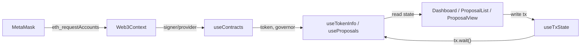

# DAO Frontend (React + Vite + Ethers v6)

Lightweight DApp UI for **MyGovernor**: connect wallet, view voting power, delegate, browse proposals, and cast votes.

## Tech stack

- **React 18** + **Vite** (function components + hooks)
- **ethers v6** for chain interaction
- **Bootstrap 5** (via CDN, no PostCSS) + small custom CSS for accent colours
- No state management library — local component state + a single `Web3Context`

## Setup

```bash
cd frontend
npm install
cp .env.example .env.local       # fill addresses after `forge script` deploy
npm run dev                      # http://localhost:5173
```

`.env.local` keys (all `VITE_*` so Vite exposes them to the browser):

| Key | Description |
| --- | --- |
| `VITE_GOVERNANCE_TOKEN` | `GovernanceToken` address |
| `VITE_GOVERNOR` | `MyGovernor` address |
| `VITE_TIMELOCK` | `TimelockController` address |
| `VITE_TREASURY` | `Treasury` address |
| `VITE_BOX` | `Box` address |
| `VITE_CHAIN_ID` | Expected chain id (default `31337` = Anvil) |
| `VITE_CHAIN_NAME` | Human-readable network name |
| `VITE_BLOCK_TIME` | Approx. seconds-per-block (default `12`) |
| `VITE_EXPLORER_URL` | Optional block explorer base URL for tx links |

## Project layout

```
frontend/
├── index.html               # Bootstrap 5 + root mount
├── vite.config.js
├── .env.example
└── src/
    ├── main.jsx
    ├── App.jsx              # composes Header / Dashboard / ProposalList / ProposalView
    ├── config.js            # contract addresses + network settings (env-driven)
    ├── styles.css           # accent colours, badges, toasts
    ├── abis/
    │   ├── GovernanceToken.js
    │   └── Governor.js
    ├── context/
    │   └── Web3Context.jsx  # provider, signer, account, chainId, MetaMask events
    ├── hooks/
    │   ├── useContracts.js  # ethers Contract instances bound to signer/provider
    │   ├── useTokenInfo.js  # ETH bal, GOV bal, voting power, delegate
    │   ├── useProposals.js  # list via ProposalCreated events + per-proposal hook
    │   └── useTxState.js    # idle → signing → pending → success | error state machine
    └── components/
        ├── Header.jsx
        ├── Dashboard.jsx
        ├── ProposalList.jsx
        ├── ProposalView.jsx
        ├── StatusBadge.jsx
        ├── TallyBar.jsx
        ├── TxToast.jsx
        └── utils.js
```

## State & data flow



- Every hook returning data also exposes a `refresh()` callback that bumps a nonce, so successful writes can re-fetch state without a full reload.
- `useTxState.run(sendTx)` wraps `sendTx → tx.wait()` and exposes a tagged status so the `<TxToast>` always reflects the current step. UI buttons use `tx.isBusy` to lock during signing/pending — preventing double submits.

## UI screens (described — placeholder for screenshots)

> Replace each block with a real screenshot once running locally; the layout below maps 1:1 to what the app renders.

### Screen 1 — `[screen-1-disconnected.png]` Disconnected state

```
┌────────────────────────────────────────────────────────────────────────┐
│ 🏛️  MyGovernor DAO                                  [ Connect Wallet ]│
├────────────────────────────────────────────────────────────────────────┤
│                                                                        │
│                          MyGovernor DAO                                │
│   Connect your wallet to view your voting power, browse proposals,     │
│                  and participate in governance.                        │
│                                                                        │
└────────────────────────────────────────────────────────────────────────┘
```

- Empty state, single primary CTA (top-right).
- If MetaMask is missing, the button is disabled with a tooltip.

### Screen 2 — `[screen-2-connected-dashboard.png]` Connected dashboard

```
┌────────────────────────────────────────────────────────────────────────┐
│ 🏛️  MyGovernor DAO        Anvil Local (chain 31337)                    │
│                           1.2345 ETH · 5,000,000 GOV    0xAbC1…f4D2    │
├────────────────────────────────────────────────────────────────────────┤
│ Your governance                                                         │
│ ┌──────────────────┐  ┌──────────────────┐  ┌──────────────────┐       │
│ │ Voting power     │  │ Token balance    │  │ Current delegate │       │
│ │ 5,000,000        │  │ 5,000,000        │  │ 0xAbC1…f4D2      │       │
│ │ GOV (delegated)  │  │ GOV              │  │ You self-delegated│      │
│ └──────────────────┘  └──────────────────┘  └──────────────────┘       │
│                                                                        │
│ Delegate voting power                                                   │
│ ┌─────────────────────────────────────────┐  ┌────────────────────┐    │
│ │ 0x… (default: yourself 0xAbC1…f4D2)     │  │ Delegate to 0xAbC… │    │
│ └─────────────────────────────────────────┘  └────────────────────┘    │
└────────────────────────────────────────────────────────────────────────┘
```

- Three stat cards (`card-stat`) with hover lift.
- Address input validates with `ethers.isAddress`; defaults to self when empty.
- Submit triggers MetaMask, then a toast in the bottom-right (see Screen 4).

### Screen 3 — `[screen-3-proposals-list.png]` Proposals list + selected proposal

```
┌── Proposals ────────────────────────────────────┐  ┌── Proposal #21623… ──┐
│ ACTIVE / IN PROGRESS                            │  │ Set Box value to 42  │
│ ┌─────────────────────────────────────────────┐ │  │ [ Active ]           │
│ │ Set Box value to 42 (the answer) [Active]   │ │  │ id #21623…f0e        │
│ │ by 0xAbC1…f4D2 · id #21623083…              │ │  │                      │
│ │ ▰▰▰▰▰▰▰▰▱▱▱▱▱▱▱  For 5,000,000 ●Against 0   │ │  │ ── Tally ──          │
│ └─────────────────────────────────────────────┘ │  │ ▰▰▰▰▰▰▱▱▱▱▱▱         │
│                                                 │  │ For 5M Against 0     │
│ PAST PROPOSALS                                  │  │                      │
│ ┌─────────────────────────────────────────────┐ │  │ ── Cast your vote ── │
│ │ Treasury: send 4 ETH grant       [Executed] │ │  │ [Optional reason… ]  │
│ │ ▰▰▰▰▰▰▰▰▰▰▰▰▰▱▱▱  For 8M Against 0          │ │  │ [👍 For] [👎 Against]│
│ └─────────────────────────────────────────────┘ │  │ [🤷 Abstain]         │
└─────────────────────────────────────────────────┘  └──────────────────────┘
```

- Active vs Past proposals are split (terminal states `Executed / Defeated / Canceled / Expired`).
- Click a row → right-pane `<ProposalView>` loads live tally + voting controls.
- The `StatusBadge` colour-codes each state: amber `Pending`, blue `Active`, green `Succeeded`, purple `Queued`, teal `Executed`, red `Defeated`, grey `Canceled / Expired`.

### Screen 4 — `[screen-4-tx-toast-pending.png]` Vote pending

```
                                                ┌──── Transaction pending ────┐
                                                │ ⟳ Casting For vote…         │
                                                │ tx: 0x4f1ac8b2…             │
                                                └─────────────────────────────┘
```

- Bottom-right toast (`<TxToast>`).
- During `signing`/`pending` all vote buttons are disabled and show inline spinners.
- `tx.txHash` becomes a clickable explorer link if `VITE_EXPLORER_URL` is set.

### Screen 5 — `[screen-5-tx-toast-success.png]` Vote confirmed

```
                                                ┌── Transaction confirmed ────┐
                                                │ ✅ Vote (For) recorded.      │
                                                │ tx: 0x4f1ac8b2…             │
                                                └─────────────────────────────┘
```

- Toast turns green; the tally bar repaints with the new For-weight; the `Cast your vote` panel collapses behind a "You have already voted on this proposal" notice (`hasVoted` returns true).

### Screen 6 — `[screen-6-tx-toast-error.png]` Error path

```
                                                ┌──── Transaction failed ─────┐
                                                │ ❌ User rejected request.    │
                                                └─────────────────────────────┘
```

- Triggered by user rejection in MetaMask, an EVM revert, or a network error.
- The toast displays `err.shortMessage ?? err.reason ?? err.message`.
- Buttons re-enable so the user can retry.

### Screen 7 — `[screen-7-final-result.png]` Finalised proposal

```
┌── Proposal: Set Box value to 42 ────────────────────────┐
│ [ Executed ]                                            │
│ id #21623083…                                           │
│ ── Tally ──                                             │
│ ▰▰▰▰▰▰▰▰▰▰▰▰▰▰▰▱  For 8,000,000  Against 0  Abstain 1.5M│
│                                                         │
│ Final state: Executed.                                  │
│ For 8,000,000 · Against 0 · Abstain 1,500,000.          │
└─────────────────────────────────────────────────────────┘
```

- Voting controls hide once the proposal reaches a terminal state.
- A summary banner replaces them with the final tally.

## Capturing real screenshots

```bash
# Terminal 1 — local chain & contract deploy
anvil
forge script script/Deploy.s.sol --rpc-url http://localhost:8545 --broadcast

# Terminal 2 — UI
cd frontend
echo "VITE_GOVERNANCE_TOKEN=…"  >> .env.local   # paste deployed addresses
npm run dev
```

Then in the browser:

1. Connect MetaMask (Anvil network, chainId `31337`, import an Anvil dev key).
2. Take screenshots of each screen above and drop them in `frontend/docs/`. Update the placeholder `[screen-N-*.png]` markers in this README to the real paths.

## Error handling & loaders — at a glance

| Surface | Loader | Error fallback |
| --- | --- | --- |
| Header balance | `—` placeholders until first read resolves | silent (header still renders) |
| Dashboard cards | `—` while `useTokenInfo.loading` | inline red text under the delegate input |
| Proposals list | full-row spinner with "Loading proposals…" | red alert + Retry button calling `refresh()` |
| Proposal view | spinner while `useProposal.loading` | `live.error` shown inline |
| Any write tx | `<TxToast>` driven by `useTxState`; `tx.isBusy` disables all relevant buttons | `status: "error"` toast displays the parsed message |

The UI never blocks the main thread — all reads are `Promise.all`-batched and writes hand off to `tx.wait()` while leaving the rest of the page interactive.
